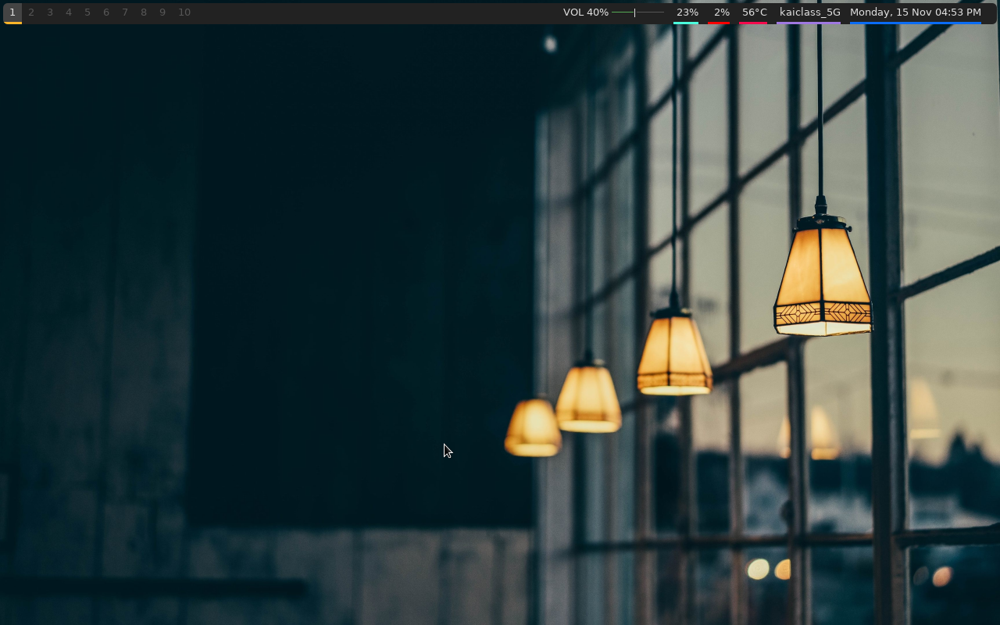

## dotfiles
My dotfiles for setting up Arch Linux with [OpenBox](https://github.com/heytuilip/public-dotfiles#openbox) & [BSPWM](https://github.com/heytuilip/public-dotfiles#bspwm).

## BSPWM
Screenshots:

 

Packages needed for the OpenBox setup:
1. [xcompmgr](https://archlinux.org/packages/extra/x86_64/xcompmgr/)
2. [nitrogen](https://archlinux.org/packages/extra/x86_64/nitrogen/)
3. [papirus-icon-theme](https://archlinux.org/packages/community/any/papirus-icon-theme/)
4. [xfce4-terminal](https://archlinux.org/packages/extra/x86_64/xfce4-terminal/)
5. [fish](https://archlinux.org/packages/community/x86_64/fish/)
6. [pkgfile](https://archlinux.org/packages/extra/x86_64/pkgfile/)
7. [inetutils](https://archlinux.org/packages/core/x86_64/inetutils/)
8. [starship](https://archlinux.org/packages/community/x86_64/starship/)
9. [polybar](https://aur.archlinux.org/packages/polybar/)
10. [sxhkd](https://archlinux.org/packages/community/x86_64/sxhkd/)

You can also get the wallpapers from [this repository.](https://github.com/heytuilip/wallpapers)

## OpenBox
Screenshots:

 

Packages needed for the OpenBox setup:
1. [xcompmgr](https://archlinux.org/packages/extra/x86_64/xcompmgr/)
2. [plank](https://archlinux.org/packages/community/x86_64/plank/)
3. [tint2](https://archlinux.org/packages/community/x86_64/tint2/)
4. [albert](https://aur.archlinux.org/packages/albert/)
5. [nitrogen](https://archlinux.org/packages/extra/x86_64/nitrogen/)
6. [obconf](https://archlinux.org/packages/community/x86_64/obconf/)
7. [papirus-icon-theme](https://archlinux.org/packages/community/any/papirus-icon-theme/)
8. [panther-launcher](https://aur.archlinux.org/packages/panther-launcher-git/)
9. [xfce4-terminal](https://archlinux.org/packages/extra/x86_64/xfce4-terminal/)
10. [fish](https://archlinux.org/packages/community/x86_64/fish/)
11. [pkgfile](https://archlinux.org/packages/extra/x86_64/pkgfile/)
12. [inetutils](https://archlinux.org/packages/core/x86_64/inetutils/)
13. [starship](https://archlinux.org/packages/community/x86_64/starship/)
14. [t2ec](https://aur.archlinux.org/packages/t2ec/)
15. [psuinfo](https://aur.archlinux.org/packages/psuinfo/)

I followed this video by Ermanno Ferrari when I was customizing OpenBox. So if you are stuck, these videos may help you: 
1. ["[9] | OpenBox: Getting Started"](https://www.youtube.com/watch?v=eRKtkmQ4yGI)

2. ["[9a] | OpenBox: Customization Tools"](https://www.youtube.com/watch?v=Ly0X-oMH2fk)

You will have to set [Nightmare.obt](other-necessary-files/Nightmare.obt) as a theme in [obconf](https://archlinux.org/packages/community/x86_64/obconf/) because [WhiteSur-dark.tar.xz](other-necessary-files/WhiteSur-dark.tar.xz) is only a GTK theme which means it will only work in GTK applications.

You can also get the wallpapers from [this repository.](https://github.com/heytuilip/wallpapers)
