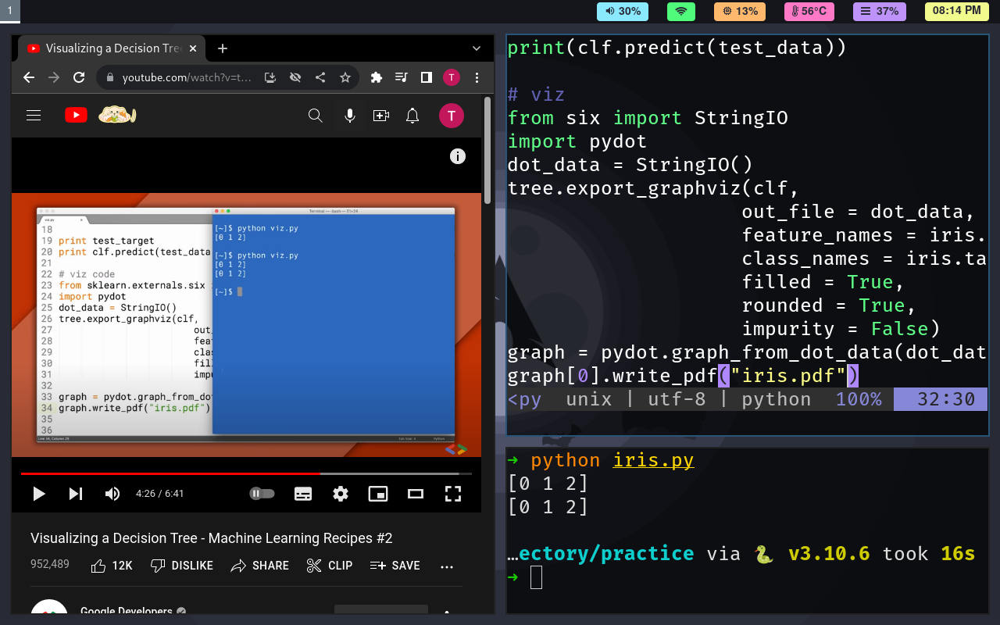

## dotfiles
My dotfiles for setting up Arch Linux with [BSPWM](https://github.com/baskerville/bspwm).


## My Setup
Screenshots:




You can get the wallpapers from [this repository.](https://github.com/tuilipshrm/wallpapers)


## Prerequisites
For Arch users, you can just download or curl [this file](https://raw.githubusercontent.com/tuilipshrm/public-dotfiles/master/arch_packages.txt) and download packages using an AUR helper(yay, paru, aura, etc.):
```
yay -S - < arch_packages.txt --needed
```

## Steps
1. Copy all the dotfiles from the root directory of the project into your home directory.
2. Copy all the folders and files from the `.config` directory into `~/.config`.
3. Optionally, copy the `scripts` folders into your home directory.
