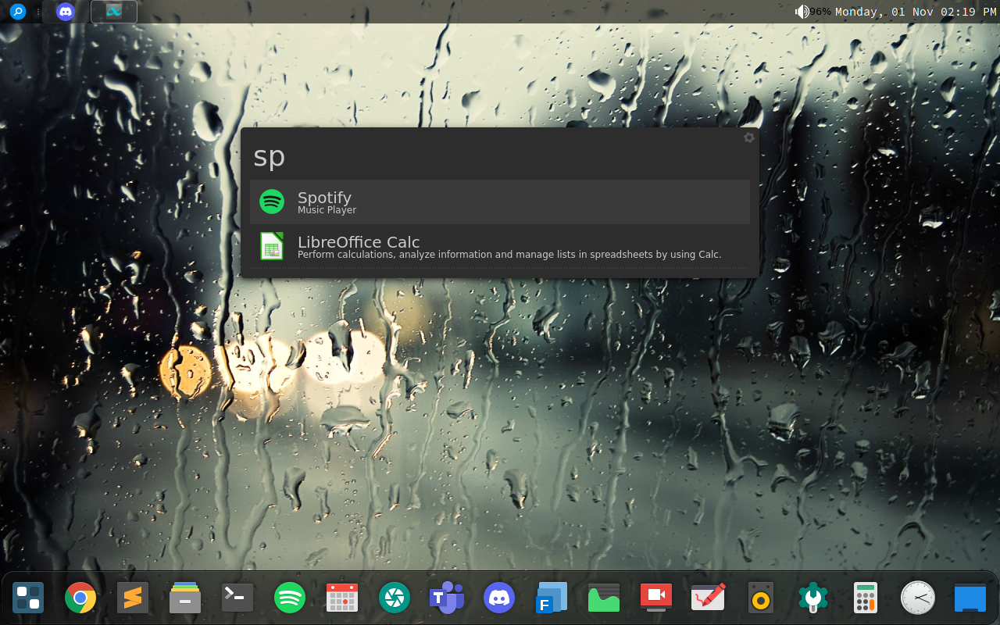

## dotfiles
My personal dotfiles for setting up Arch Linux with OpenBox.

Screenshots:

 

# Packages needed for this setup:
1. [xcompmgr](https://archlinux.org/packages/extra/x86_64/xcompmgr/)
2. [plank](https://archlinux.org/packages/community/x86_64/plank/)
3. [tint2](https://archlinux.org/packages/community/x86_64/tint2/)
4. [albert](https://aur.archlinux.org/packages/albert/)
5. [nitrogen](https://archlinux.org/packages/extra/x86_64/nitrogen/)
6. [papirus-icon-theme](https://archlinux.org/packages/community/any/papirus-icon-theme/)
7. [fish](https://archlinux.org/packages/community/x86_64/fish/)
8. [pkgfile](https://archlinux.org/packages/extra/x86_64/pkgfile/)
9. [inetutils](https://archlinux.org/packages/core/x86_64/inetutils/)
10. [inetutils](https://archlinux.org/packages/core/x86_64/inetutils/)
11. [starship](https://archlinux.org/packages/community/x86_64/starship/)
12. 
13. 
